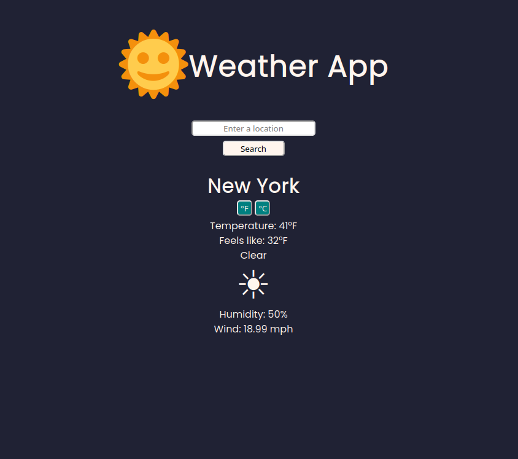

Weather app

============

A mobile responsive weather app that I made to practice using APIs and Javascript Promises.

---

## Features
- User can receive (delayed) real-time weather data for most cities, states, countries
- Fahrenheit to Celcius converter
## Built With
- Vanilla Javascript
- SCSS
## Concepts
- Javascript Promises
- Fetch API
- Asynchronous data manipulation

---